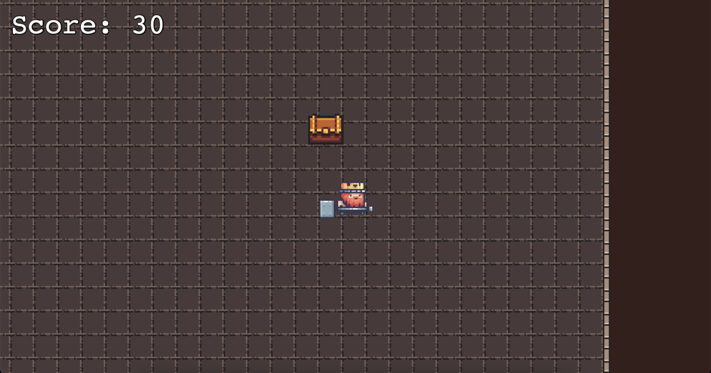

<h1 align="center">Welcome to king-game 👋</h1>
<p>
  
   
  <a href="#" target="_blank">
    
  </a>
</p>

> Game Phaser 3

## Install

```sh
npm install
```

## Usage

```sh
npm run start
```

## Run build

```sh
npm run build
```

## Show your support

Give a ⭐️ if this project helped you!

---

_This README was generated with ❤️ by [readme-md-generator](https://github.com/kefranabg/readme-md-generator)_

_Tutorial: [making a phaser 3 game](https://shakuro.com/blog/phaser-js-a-step-by-step-tutorial-on-making-a-phaser-3-game/)_
